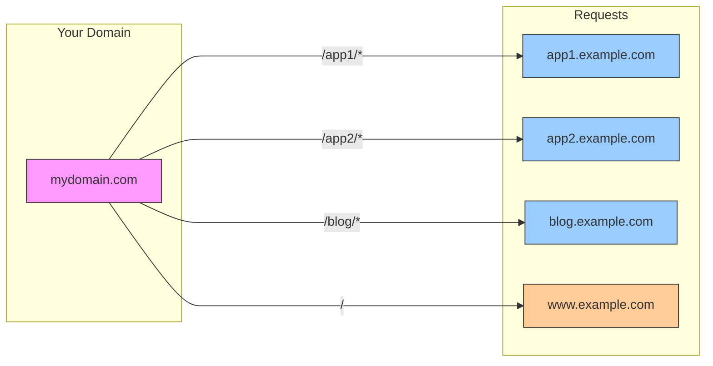
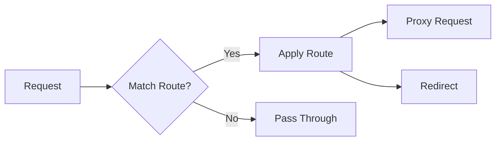

# Path-Based Application Router

This Cloudflare Worker provides a way to serve multiple applications under different paths of a single domain, while maintaining separate deployments. It supports both proxy routing and HTTP redirects.



I use this worker to serve multiple applications under [tools.osteele.com](https://tools.osteele.com):
```javascript
const ROUTES = {
   '/claude-artifact-viewer/*': 'proxy:https://claude-artifact-viewer.underconstruction.fun/*',
  "/shutterspeak/*": "proxy:https://shutterspeak.underconstruction.fun/*",
  '/tone-curve/*': 'proxy:https://tone-curve.underconstruction.fun/*',
  '/': 'https://osteele.com/tools'
};
```
This lets me maintain separate deployments for each tool while serving them under my `tools.osteele.com` subdomain.

## Installation and Usage

1. Create a new Cloudflare Worker project:

```bash
npm create cloudflare@latest
```

2. Install this package:

```bash
bun add @osteele/path-router
# or: npm install @osteele/path-router
```

3. Create a `src/worker.ts` file with your routing configuration:

```typescript
import { createRouter } from '@osteele/path-router';
const ROUTES = {
  '/app1/*': 'proxy:https://app1.example.com/*',
  '/app2/*': 'proxy:https://app2.example.com/*',
  '/': 'https://example.com'
};
export default createRouter(ROUTES);
```

4. Update your `wrangler.toml`:

```toml
name = "path-router"
main = "src/worker.ts"
compatibility_date = "2024-01-01"
```

5. Deploy to Cloudflare:
```bash
wrangler deploy
```

After deployment, requests to your worker's domain will be routed according to your configuration:
- `your-worker.example.com/app1/page` → `app1.example.com/page`
- `your-worker.example.com/app2/path` → `app2.example.com/path`
- `your-worker.example.com/` → redirects to `example.com`

## Use Cases

1. **Multiple Apps, Single Domain**: Serve multiple independently deployed applications under a single domain:
   - `mydomain.com/app1` → `app1.otherdomain.com`
   - `mydomain.com/app2` → `app2.otherdomain.com`

2. **Path-Based Routing**: Route specific paths to specific locations:
   - `mydomain.com/tools/x` → `tools.otherdomain.com/x`
   - `mydomain.com/app` → `otherdomain.com/app`

3. **HTTP Redirects**: Redirect specific paths to external URLs:
   - `mydomain.com/` → `302 redirect to otherdomain.com/tools`

4. **Pass-through Routing**: Any paths not explicitly configured pass through to normal Cloudflare handling.

## Configuration

### Configuration Format

The worker uses a simple routing table:

```javascript
const ROUTES = {
  // Proxy routes - use /* to indicate subpath matching
  '/apps/calculator/*': 'proxy:https://calc.example.com/*',
  '/blog/*': 'proxy:https://blog.example.com/*',

  // HTTP redirect - exact path match (no wildcard)
  '/': 'https://www.example.com',
  '/about': 'https://about.example.com'
};
```

Each entry maps a path to either:
- A proxy route (`proxy:` prefix and `/*` suffix) - requests will be proxied, preserving additional path segments
- A redirect route (no prefix, no wildcard) - requests will receive a 302 redirect, exact path match only

## How It Works

1. **Path Matching**: When a request comes in, the worker checks the path against configured routes.



2. **URL Handling**:
   ```text
   # Proxy Route Example:
   your-worker.com/app1/page?q=123   →   app1.example.com/page?q=123
   └─── match ───┘└── subpath ──┘└─q─┘   └─── target ───┘└─same─┘└─q─┘

   # Redirect Example:
   your-worker.com/tools   →   302 →   tools.example.com
   └─── exact match ──┘              └─── destination ───┘
   ```

3. **Pass-through**: If no match is found, the request passes through to normal Cloudflare handling

4. **Headers**:
   ```mermaid
   flowchart TD
       A[Request] --> B{Content Type?}
       B -->|HTML| C[No Cache]
       B -->|Static Asset| D[Long Cache]
       B -->|Other| E[Default Cache]
       C & D & E --> F[Send Response]
   ```

## Client Application Requirements

Applications being served through this worker should:

1. Use relative paths for assets and navigation (e.g., "styles.css" instead of "/styles.css")
2. Be built without a hardcoded base path

For Vite applications, this can be achieved with:
```javascript
// vite.config.js
export default defineConfig({
  base: '', // Empty string forces relative paths
})
```

## Development

This project uses Bun for development and testing. Make sure you have Bun installed:

```bash
curl -fsSL https://bun.sh/install | bash
```

Install dependencies:
```bash
bun install
```

Run development server:
```bash
bun run dev
```

Run tests:
```bash
bun test
```

Type checking:
```bash
bun run type-check
```

## Notes

- The worker preserves query parameters
- Error handling is included for failed requests
- Caching is configured appropriately for different content types
- Host headers are managed to avoid conflicts

## License

MIT License. Copyright © 2024 Oliver Steele. See [LICENSE](LICENSE) for details.
