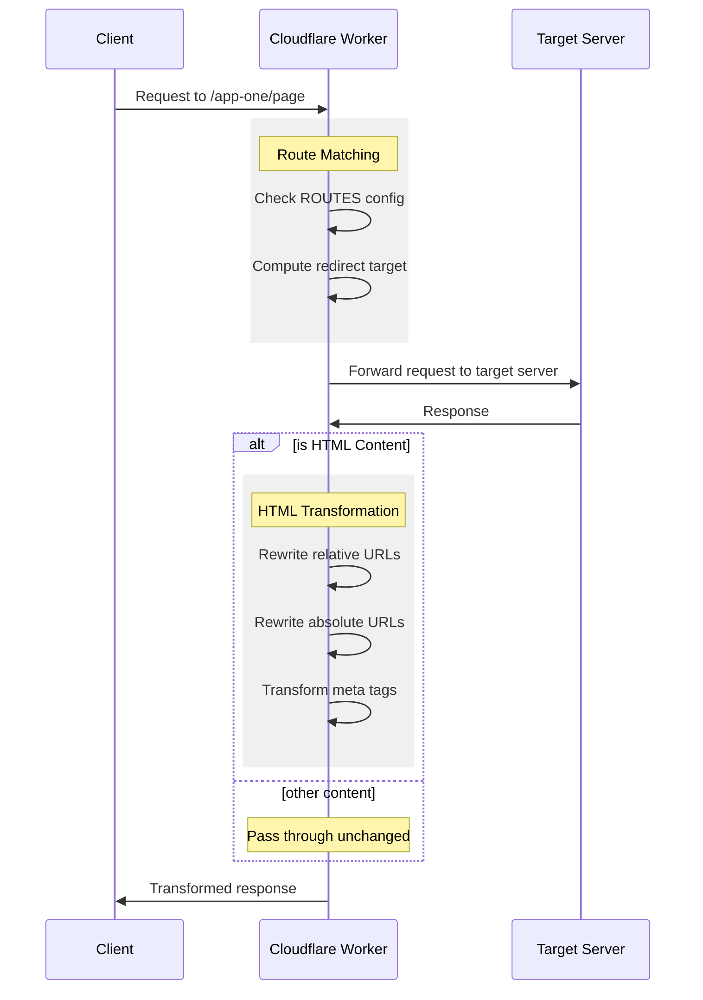
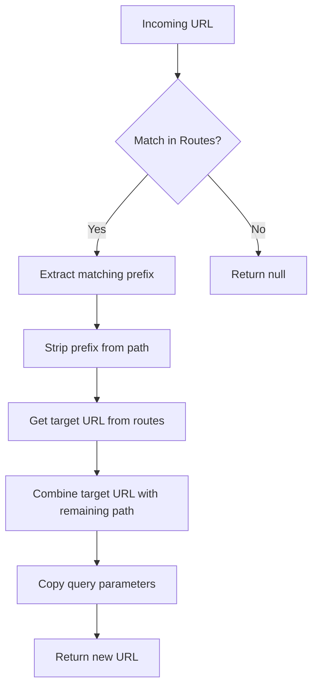
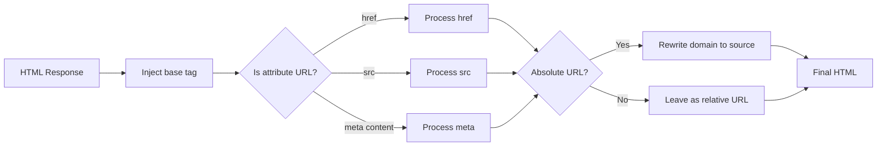

# URL Router and HTML Transformer Specification

## Overview
This service provides URL routing and HTML content transformation for applications hosted across multiple domains. It operates as a Cloudflare Worker, intercepting requests and either forwarding them to their destination or transforming and redirecting them as needed.

## Configuration
Routes are configured via the `ROUTES` environment variable as a JSON object mapping source paths to target URLs:

```json
{
  "/app-one/*": "proxy:https://app-one.example.com/*",
  "/app-two/*": "proxy:https://app-two.example.com/*",
  "/": "https://example.com/tools"
}
```

## Routing Behavior

### Route Types

1. **Proxy Routes**
   - Format: `"/path/*": "proxy:https://target.domain/*"`
   - Wildcard (`*`) in path indicates subpath matching
   - Forwards request to target, preserving path segments after the match
   - `/path` and `/path/` are treated as `/path/*`

2. **Redirect Routes**
   - Format: `"/path": "https://target.domain"`
   - No wildcard - requires exact path match
   - Returns 302 redirect response
   - Preserves query parameters

### Path Matching
- Proxy routes with wildcards:
  - `/app/*` matches `/app`, `/app/`, and `/app/any/path`
  - Matched portion is replaced with target URL base
  - Example: `/app/page` → `https://app.example.com/page`
- Redirect routes:
  - Exact matches only: `/about` only matches exactly `/about`
- Non-matches:
  - Returns null for any unmatched routes

### URL Transformation
1. When a match is found:
   - The matching prefix is stripped from the source path
   - The remaining path is appended to the target URL
   - Query parameters are preserved
   - Example: `/app-one/editor?id=123` → `https://app-one.example.com/editor?id=123`

2. When no match is found:
   - The request is passed through unchanged
   - No transformation occurs

## HTML Content Transformation

### Trigger Conditions
HTML transformation occurs when:
- The response Content-Type is `text/html` or `application/xhtml+xml`
- The URL path ends with `.html`

### Base Tag Injection
- A `<base>` tag is injected at the start of the `<head>` element
- The base href is set to the source path with a trailing slash
- Example: For route `/app-one`, injects `<base href="/app-one/">`
- This ensures relative URLs (including `./` and `../`) resolve correctly

### URL Rewriting Rules

#### Relative URLs
With the base tag in place:
- Relative URLs are resolved by the browser relative to the base path
- `./icon.png` resolves to `/app-one/icon.png`
- `../manifest.json` resolves to `/manifest.json`

#### Absolute URLs
Absolute URLs from the target domain are rewritten to the source domain:
- `https://app-one.example.com/page` → `https://source.example.com/app-one/page`

Affected elements:
- Meta tags with URL content (e.g., `og:url`)
- Any `href` or `src` attributes containing absolute URLs

### Caching Behavior

#### Default Cache Control Headers
When no Cache-Control header is present:
- HTML content: `no-cache`
- Other content: `public, max-age=31536000`

#### Existing Headers
- Existing Cache-Control headers are preserved
- No transformation of other headers occurs

## Request Handling

### Header Modifications

- The `host` header is removed from forwarded requests
- All other headers are preserved

### Error Handling

- Returns 500 status code for processing errors
- Includes error message in response body
- Maintains original status codes for successful transformations

## Security Considerations

- Only transforms URLs for configured routes
- Preserves HTTPS protocol
- Maintains all security headers from origin response
- Does not modify response body content beyond URL transformations

## Performance

- Uses streaming HTML transformation
- Processes content without loading entire response into memory
- Minimal impact on response time for non-HTML content

## System Diagrams

### Request Flow



### URL Transformation Logic



### HTML Rewriting Process


